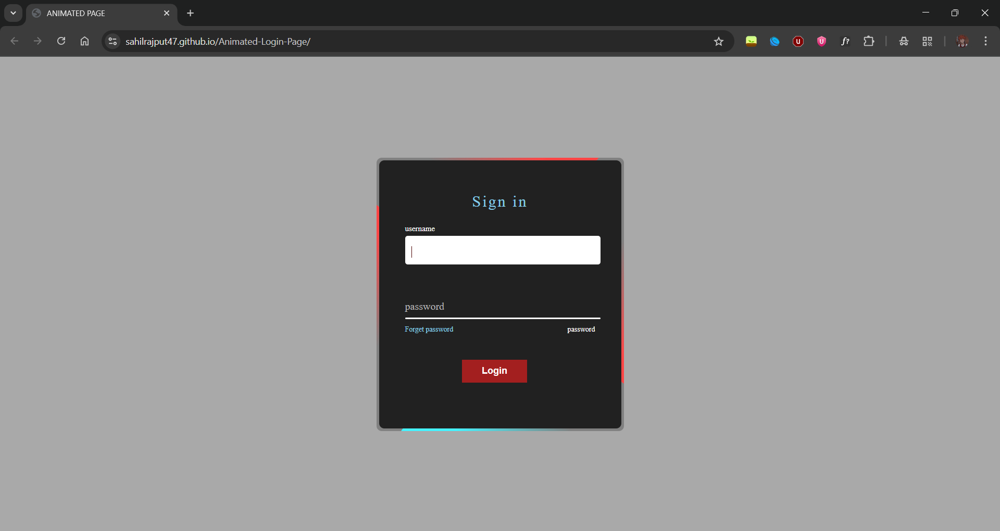

<h1 align="center">🔐 Animated Login Page</h1>

<p align="center">
  A sleek, stylish & fully responsive <b>Login UI</b> crafted with modern <b>HTML + CSS</b><br>
  Featuring ✨ smooth animations, modern layout, and trendy icon sets.
</p>

<p align="center">
  <a href="https://github.com/SahilRajput47/animated-login-page"></a>
  <a href="https://github.com/SahilRajput47/animated-login-page"></a>
  <a href="#"></a>
</p>

---

## 🚀 Live Demo

🔗 **[Click Here to View Live](https://sahilrajput47.github.io/Animated-Login-Page/)**

---

## 🌟 Features

- 🌀 **Animated & Modern Interface**
- 📱 **Responsive Design for All Devices**
- 🎨 **CSS Transitions & Effects**
- 🔣 **Latest Icon Libraries**
  - Font Awesome
  - Remix Icons
  - Google Material Symbols
- 🧼 **Clean, Modular Codebase**
- 🖥️ **Cross-Browser Compatibility**

---

## 🖼️ Preview

<p align="center">
  
</p>

---

## 🛠️ Tech Stack

| Tool | Description |
|------|-------------|
| 🔤 **HTML5** | Page structure |
| 🎨 **CSS3** | Styling & animations |
| 💠 **Icons** | Font Awesome, Remix Icons, Google Symbols |

---

## 📁 Folder Structure
animated-login-page/
├── index.html
├── style.css
├── assets/
│ ├── icons/
│ └── images/
└── README.md

---

## ⚙️ Setup Instructions

### 🖥️ Method 1: Clone & Launch

```bash
git clone https://github.com/SahilRajput47/animated-login-page.git
cd animated-login-page
# Open index.html in your browser

🌐 Method 2: Drag & Drop
Just drag index.html into your browser.

🔗 Connect with Me
Platform	Link
📧 Email	Sahilrajput4763@gmail.com
🐙 GitHub	@SahilRajput47
📷 Instagram	@sahil_rajput.74


🤝 I’d love to hear your feedback or collaborate on cool UI projects!

📝 License
This project is licensed under the MIT License.
You’re free to use, modify, and share it with attribution.

⭐ Show Some Love
If you found this useful or cool, don’t forget to star the repository!


